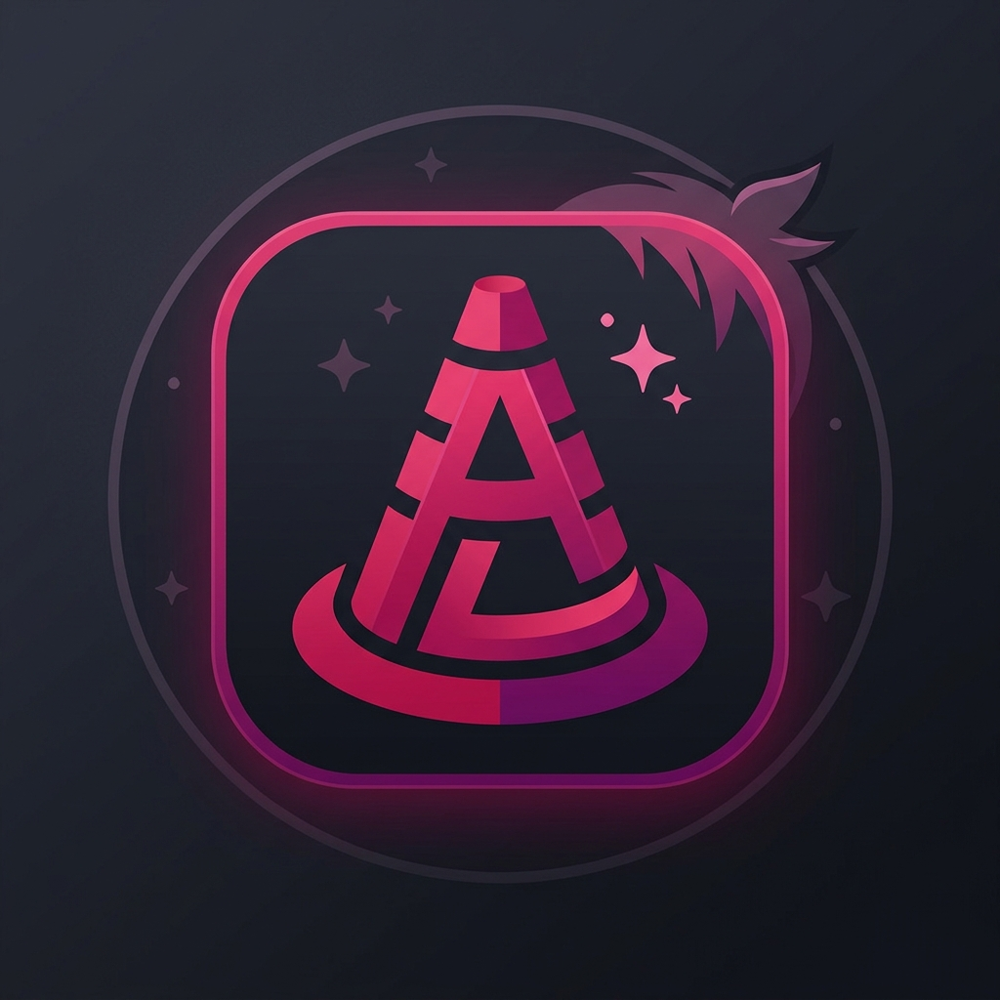
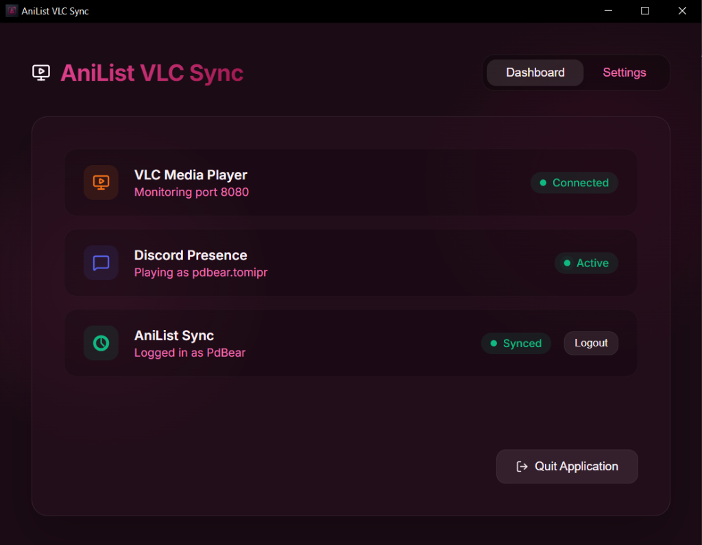

<div align="center">
  
  <h1>🎬 AniList VLC Sync 🎮</h1>
  <p>A beautiful desktop application that automatically syncs your anime watch progress from VLC Media Player to AniList and displays your real-time status on Discord.</p>
</div>

---

## 🌟 What is this?
Ever tired of manually updating your episode count on AniList after watching anime on VLC? Want to show off what you're currently watching to your Discord friends? **AniList VLC Sync** is here for you!

This application runs quietly in the background and connects **VLC Media Player**, **AniList**, and **Discord**. Just sit back, watch your downloaded anime, and let the app do the rest.

## ✨ Features
- **🎨 Beautiful GUI**: Easy-to-use modern desktop interface.
- **🔄 Auto-Sync to AniList**: Automatically detects when you finish an episode and updates your AniList progress!
- **💬 Discord Rich Presence**: Shows the anime title, episode number, cover image, and elapsed/remaining time directly on your Discord profile.
- **🧠 Smart Title Detection**: Intelligently extracts the anime name and episode number from messy filenames (e.g., `[SubsPlease] Girls und Panzer - 11 (1080p).mkv`).
- **🔒 Secure Login**: Simple PIN-based AniList login directly from the app.

---

## 🚀 How to Install (For Users)

### 1. Download the App
- Go to the [Releases](../../releases) tab on GitHub and download the latest `.exe` setup file.
- Install and open the application.

### 2. Configure VLC Media Player
For the app to know what you're watching, you must enable VLC's web interface:
1. Open VLC Media Player.
2. Go to **Tools > Preferences** (or press `Ctrl+P`).
3. At the bottom left under *Show settings*, select **All**.
4. In the left menu, navigate to **Interface > Main interfaces**.
5. Check the box for **Web**.
6. Expand **Main interfaces** and click on **Lua**.
7. Under *Lua HTTP*, set a **Password** (e.g., `1234`).
8. Restart VLC.

### 3. Setup the App
1. Open **AniList VLC Sync**.
2. In the **Settings** menu, enter your AniList Username.
3. Enter the VLC port (`8080` by default) and the password you just created in VLC.
4. Go to the **Status** page, click **Connect AniList**, authorize the app, and paste the PIN provided.
5. You're ready to go! Open an anime in VLC and watch the magic happen.

---

## 📸 Previews



---

## 💻 For Developers

If you want to contribute or build the app from source, you'll be happy to know that this project is structured using **Clean Architecture** principles!

### Tech Stack
- **Frontend**: React, Vite, TypeScript.
- **Backend**: Electron, Node.js, Winston (Logger).
- **APIs**: AniList GraphQL API, `@xhayper/discord-rpc`, VLC HTTP API.

### Build Instructions
1. **Clone the repository**:
   ```bash
   git clone https://github.com/yourusername/anilist-vlc.git
   cd anilist-vlc
   ```
2. **Install dependencies**:
   ```bash
   npm install
   ```
3. **Run in Development Mode**:
   ```bash
   npm run electron:dev
   ```
4. **Build the Production Executable (.exe)**:
   ```bash
   npm run electron:build
   ```

### Architecture Overview
The application backend is separated into strict layers to maintain a clean dependency flow:
- **Domain**: Pure business rules and entities (`DiscordActivity`, `PlaybackStatus`).
- **Application**: Use cases like `BuildPresenceUseCase` and `UpdateProgressUseCase`.
- **Infrastructure**: Concrete implementations (VLC API adapter, Discord RPC adapter).
- **Presentation**: Electron IPC handlers and background polling controllers.

---

## 📜 License
This project is licensed under the ISC License. Feel free to fork, modify, and distribute!
